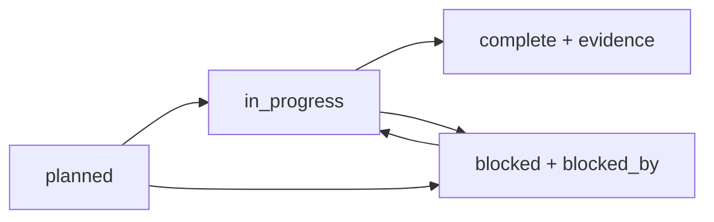

# ClawBench WebsiteBench 项目管理

本项目的唯一目标是评估 Agent 能否只通过浏览器交互一个既有离线网站，
复刻它的可见界面、关键交互和必要的前后端语义，并在 Harbor 的隔离架构下
由独立验证器完成可重复评分。

`project/plan.json` 是项目状态的单一事实源。本文解释治理方法，不替代计划
中的当前状态、负责人、依赖、风险、决策和发布门禁。

## 快速查看状态

```bash
clawbench-project validate
clawbench-project status
clawbench-project check-release
```

- `validate` 校验 JSON Schema、重复键、唯一 ID、owner、依赖和完成证据。
- `status` 汇总 workstream、milestone、backlog、blocker 和 release gate。
- `check-release` 只有在全部门禁为 `passed` 时返回 0；未就绪返回 3，计划
  无效返回 2。

截至 2026-07-23，项目治理基线和 Harbor authoring 工具链已完成；真实站点
仍在收敛，首个真实 Harbor instance、NOP/oracle 校准和人工浏览器验收尚未
完成。Viewer 集成当前受到并行 Amazon/Viewer 标识合约改动的阻塞，因此不将
整个 benchmark 标为 release-ready。

## 管理对象

### Workstream

Workstream 表示持续性的工作面，例如离线复刻、Harbor authoring、实例扩容
和 Viewer 集成。它描述长期 outcome 与固定 deliverables。

### Milestone

Milestone 表示可以客观判定的阶段结果。每个里程碑必须有 exit criteria、
owner、依赖和证据；`complete` 不能只由主观描述支持。

### Backlog

Backlog 是可执行工作项，按 `P0`、`P1`、`P2` 排序。每项必须给出 acceptance
criteria。`blocked` 项必须记录具体阻塞条件，不能把“工作困难”写成阻塞。

### Risk 与 Decision

Risk 记录触发条件和缓解措施。Decision 记录不可隐含改变的架构选择，例如
Browser Use/Playwright 职责分离、site/instance 分层和 exact CTRF 计分。
如果改变已接受决策，应新增替代决策并把旧决策标为 `superseded`。

### Release gate

Release gate 是发布事实，不是开发进度。静态 schema、单元测试、真实 Harbor
校准、隔离审计、人工浏览器审核和再分发检查分别记录，不互相替代。

## 状态转换



只有客观 exit/acceptance criteria 已满足且 evidence 可追溯时才能进入
`complete`。修复代码但未完成校准、人工检查或发布审计，仍应保持
`in_progress`。

## 责任边界

| 角色 | 负责 | 不应替代 |
| --- | --- | --- |
| Benchmark Maintainer | schema、CLI、兼容性、计划与集成门禁 | 站点作者的范围判断 |
| Site Author | 证据、资源闭包、前端复刻、后端不变量与 reset | verifier 的正式评分 |
| Instance Author | instruction、starter、测试节点和 oracle | site 的安全边界 |
| Verifier Author | 差分检查、隔离、CTRF、NOP/oracle 校准 | 人工视觉验收 |
| Human Reviewer | 真实浏览器中的视觉、交互和边界状态 | 机器分数 |
| Release Manager | 发布清单、全部门禁和再分发检查 | 缺失证据的完成声明 |

角色是职责，不要求每次由不同自然人承担；但产物和证据边界必须保持独立。

## 一项复刻工作的完整生命周期

1. 在 `project/plan.json` 中登记 backlog 项，写清 owner、优先级、acceptance
   和依赖。
2. 在 site 层冻结用途、核心用户旅程、页面/状态矩阵、语义不变量和非目标。
3. 完成匿名、只读的源证据采集和本地资源闭包；记录不可直接比较的状态。
4. 先完成前端路由/状态/视觉闭环，再实现冻结旅程真正需要的后端语义。
5. 通过离线、reset、功能、视觉和人工浏览器检查，把证据路径写回计划。
6. 用 `clawbench-harbor init-site` 和 `init-instance` 建立规范化 authoring 源。
7. 由 Agent 使用 Browser Use CLI 探索 reference；由独立 verifier 使用
   Playwright 和 HTTP 做 reference-first 顺序差分。
8. 在真实 Harbor 执行 NOP、oracle、重复性和抗代理校准。
9. 更新 milestone 与 release gate；全部门禁通过后才进入正式语料。

## Site Definition of Done

- scope contract、route/state matrix、semantic invariants 和 non-goals 已冻结。
- 运行时完全离线，无远程图片、字体、API 或遥测依赖。
- reference 可稳定启动、健康检查、reset，并对相同 seed 产生确定状态。
- 核心页面和关键状态有直接浏览器证据；不可访问状态明确标记为
  unavailable 或 inferred。
- 后端强制验证身份、授权、状态转换、库存/金额等服务端不变量。
- 许可证、所有权、再分发限制、模拟能力和已知差异已记录。

## Instance Definition of Done

- `instance.yaml` 通过 schema 与语义校验，目录名、site 引用和测试节点合法。
- instruction 只描述 Agent 可观察目标，不泄漏隐藏 expectation。
- contract、API、UI、visual、journey、robustness 均有测试节点。
- bundle 生成可重复；Agent seed 不含 reference、verifier、hidden fixture 或
  oracle。
- reference expectation 先采集，candidate 检查后执行；candidate 不能代理
  reference。
- exact CTRF、artifact 和 `reward.txt` 一致，总权重严格为 100。
- NOP、oracle、重复性与人工浏览器验收全部有真实运行证据。

## Benchmark 扩容规则

新增题目必须从“能力覆盖”出发，而不是只增加页面数量。需求卡至少写明：

- 站点用途、核心角色、主线旅程与失败旅程；
- 新增的视觉状态、交互状态、后端状态转换和持久化语义；
- reference 与 candidate 的 reset、seed 和 admin 控制面；
- public、reference-only、verifier-only、fixture-only、oracle-only 可见性；
- NOP/oracle 阈值和人工验收范围；
- 与现有题目的重叠点和新增能力覆盖。

扩容到 10 题时应统计不同的旅程、边界状态、授权规则、库存/金额/订单等语义
覆盖，不能把同一套简单 Web CRUD 换皮视为新的前后端联合题。

## 变更控制

每个影响 benchmark 行为的变更应同时检查：

1. `project/plan.json` 的 backlog、risk、decision 或 gate 是否要更新；
2. `docs/offline-clone-harness.md` 或 `docs/harbor-fullstack-benchmark.md` 是否受影响；
3. 仓库版本化 `skills/build-offline-site-clone/` 是否仍能指导 Agent；
4. schema、CLI、模板和测试是否同步；
5. Viewer、旧 fixture 和已发布 instance 是否需要兼容或迁移。

合并前至少运行：

```bash
clawbench-project validate
ruff check src tests websitebench
python -m pytest tests/project tests/offline_clone tests/harbor -q
python -m pytest tests/viewer -q
```

若某组测试因并行工作树改动已知失败，应在计划中保留 blocker，不得删除测试、
降低门禁或把未执行标成通过。
