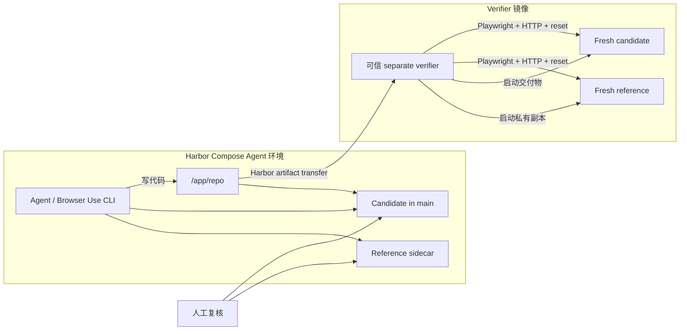

# Harbor 前后端离线网站复刻 Benchmark 规范

## 1. 目标与边界

本规范用于测试 Agent 是否能在**只能通过浏览器交互既有离线网站**的条件下，
从零复刻其前端视觉、交互状态和后端语义。它不是给已有代码打补丁，也不是让
Agent 读取 reference 仓库后照搬。

一题的完成闭环是：

1. Agent 通过 Browser Use CLI 浏览 reference，形成行为与视觉假设；
2. Agent 在 `/app/repo` 实现 candidate，并继续用浏览器自检；
3. Harbor 的 separate verifier 以可信身份重置 reference/candidate；
4. verifier 使用 Playwright、HTTP API 和视觉比较执行隐藏 checks；
5. exact CTRF 节点集被折算为 0–100 分，再映射为 Harbor 的 0–1 reward；
6. 人工抽检时直接在浏览器并排打开 reference 与 candidate。

Browser Use CLI 和 Playwright 的职责不能混用：前者是 Agent 的探索/自检通道，
后者是机器正式判分通道。人工浏览器抽检也不能替代可重复的机器 verifier。

## 2. 运行与信任架构



强制边界：

- reference 的实现源码、数据库快照、隐藏 fixtures、checks 和 oracle 不得进入
  Agent `main` image；reference 源码只用于构建网络 sidecar 并烘入 verifier；
- Agent 只得到 `instruction.md`、初始 candidate 仓库、公开接口契约以及浏览器
  URL 环境变量名；
- verifier 代码与最终报告位于 candidate 不可写的文件系统；
- reference 与 candidate 在每个可变状态场景前使用同一 fixture 重置；
- judge 阶段禁止访问公网；所有运行资源必须闭包到离线环境；
- candidate 崩溃是有效的 0/低分结果；verifier 自身崩溃或报告损坏是
  `INVALID_RUN`，二者不得混淆。

## 3. Authoring 文件规范

Authoring 源文件放在 `harbor/`，生成物放在被 Git 忽略的 `harbor-dist/`。

```text
harbor/
├── sites/
│   └── <site-id>/
│       ├── site.yaml
│       ├── public/
│       ├── verifier/
│       │   └── run.py
│       ├── fixtures/hidden/
│       └── oracle/
└── instances/
    └── <instance-id>/
        ├── instance.yaml
        ├── instruction.md
        ├── public/
        ├── reference/              # private sidecar build context
        ├── verifier/
        ├── fixtures/hidden/
        └── solution/solve.sh
```

### 3.1 Site baseline

`site.yaml` 遵循
`websitebench/schemas/harbor-site.schema.json`，负责描述可以被多个题目复用的
网站级事实：

- `runtime`：四个 public/admin URL 环境变量名、ready/reset path、Agent 与
  verifier 的浏览器驱动器、离线网络策略；
- `paths.public`：Agent 可见的接口说明、数据模型、空白资源或 starter
  contract，不得放 reference 实现；
- `paths.reference`：冻结的 reference sidecar build context；必须有可构建的
  Dockerfile 和 healthcheck，不会被 `environment/Dockerfile` COPY 进 `main`；
- `paths.verifier`：网站级可信 evaluator；
- `paths.hidden_fixtures`：统一 reset 状态、账号、边界数据；
- `paths.oracle`：仅校准使用的私有辅助材料；
- `scoring.dimensions`：总和必须恰好为 100。

默认维度是 `contract/api/ui/visual/journey/robustness`，可选
`efficiency`。必需维度的权重必须大于 0。

### 3.2 Instance overlay

`instance.yaml` 遵循
`websitebench/schemas/harbor-instance.schema.json`，只描述一道题与同站其他题的
差异：

- `site_manifest` 以 `harbor/` 为根，例如 `sites/shop/site.yaml`；
- `instruction.md` 只陈述目标、范围、可观察行为和交付约束，不暴露隐藏断言；
- `public/` 是 candidate 初始仓库覆盖层；
- `verifier/` 与 `fixtures/hidden/` 是该题特有的隐藏检查和状态；
- `solution/solve.sh` 构造完整可运行 oracle candidate；
- Harbor artifact 固定为 `/app/repo`，表示 separate verifier 会收到的 Agent
  最终交付目录；
- `tests` 声明正式判分允许出现的 exact node set；
- `calibration` 声明 NOP 上限和 oracle 下限。

`public/run.sh` 是统一 candidate 启动契约：从 `/app/repo` 执行，监听环境变量
`PORT` 指定的端口，运行数据写入 `CLAWBENCH_DATA_DIR`，并在 `ready_path` 返回
成功。不得依赖公网安装依赖。`reference/run.sh` 使用同一 `PORT` 约定，供
separate verifier 在不运行 Docker-in-Docker 的情况下启动可信 reference。

需要额外构建依赖时，网站级 Agent 依赖写在
`public/install-agent.sh`，题目级 Agent 依赖写在 instance
`public/install-agent.sh`；verifier 依赖使用
`verifier/requirements.txt` 或 `verifier/install-verifier.sh`。这些脚本只在
Docker build 阶段执行，judge runtime 仍保持无公网。

题目 ID、站点 ID、测试节点全部使用稳定 slug。测试节点格式为
`<dimension>::<journey-or-feature>/<assertion>`，例如：

```yaml
tests:
  contract:
    - contract::runtime/starts-and-resets
  api:
    - api::cart/add-and-read
    - api::cart/server-side-validation
  ui:
    - ui::cart/empty-state
    - ui::cart/quantity-interaction
  visual:
    - visual::cart/desktop-checkpoint
  journey:
    - journey::checkout/cart-to-confirmation
  robustness:
    - robustness::cart/refresh-and-retry
  efficiency: []
```

每个 full-stack instance 至少需要 1 个 contract、2 个 API、2 个 UI、1 个
visual、1 个 journey 和 1 个 robustness 节点。节点在整题内必须全局唯一，
且前缀必须与所属维度一致。

## 4. 生成的 Harbor bundle

`clawbench-harbor materialize` 生成自包含目录：

```text
<instance-id>/
├── task.toml
├── instruction.md
├── environment/
│   ├── Dockerfile
│   ├── docker-compose.yaml           # main + network-only reference sidecar
│   ├── reference/                    # 不进入 main image
│   └── seed/
│       ├── .clawbench/
│       │   ├── browser-contract.json
│       │   └── site/
│       └── ...candidate starter...
├── tests/
│   ├── Dockerfile
│   ├── test.sh
│   ├── browser_lib.py
│   ├── service_lib.py
│   ├── merge_ctrf.py
│   ├── compute_reward.py
│   ├── required-nodes.json
│   ├── runtime-contract.json
│   ├── reference/                    # verifier 内 fresh reference
│   ├── site/
│   ├── instance/
│   └── fixtures/
├── solution/
│   ├── solve.sh
│   └── site/
├── authoring/                        # normalized private manifests
└── bundle-manifest.json
```

`task.toml` 使用当前 Harbor schema 1.4，固定
`environment_mode = "separate"`，资源使用 `memory_mb/storage_mb`，并声明
`/app/repo` 为跨环境 artifact。Agent baseline 只允许访问 Compose 内的
`reference` 主机，verifier baseline 无公网。

生成器拒绝覆盖已有输出，先在同盘临时目录完整生成，再原子改名。
`bundle-manifest.json` 对每个文件记录大小、SHA-256 和
`agent-public/build-control/reference-sidecar-only/verifier-only/oracle-only`
分类。这里的 `agent-public` 表示会被 Agent Dockerfile COPY 的内容；
`build-control` 是 Dockerfile/Compose 配置；sidecar build context 虽然属于
task bundle，但不会出现在 Agent 容器文件系统中。

## 5. Site verifier 接口

每个 site 必须实现 `verifier/run.py`，命令行接口固定为：

```bash
python /tests/site/run.py \
  --contract /tests/runtime-contract.json \
  --required /tests/required-nodes.json \
  --output /run/verifier-final
```

该程序必须：

1. 先从 `/tests/reference` 启动 fresh reference，按 runtime contract 的
   reference verifier port 设置 URL，并注入 fixture；
2. 完成 reference 的 API/UI/visual 事实捕获，关闭全部 reference 浏览器 context
   和进程；
3. 再以 uid 10001 从 Harbor 传入的 `/app/repo` 启动 candidate，按 candidate
   verifier port 设置 URL，注入同一 fixture，并执行相同步骤；
4. 以新的浏览器 context 执行每个独立 scenario；
5. 把 candidate 启动失败、超时和断言失败转成测试节点的 `failed`，并正常
   `exit 0`；
6. 对 evaluator 自身契约缺失、fixture 不可用、reference 无法启动等基础设施
   问题 `exit != 0`；
7. 写出 `$output/ctrf.json`，节点集合与 `required-nodes.json` 完全一致；
8. 将截图、trace、console error、failed request 和 API 日志写入 `$output`。

通用 `service_lib.py` 提供低权限进程、ready wait、进程组清理、local URL
配置和 candidate 启动失败时的 exact-node fallback；它会拒绝在同一 evaluator
进程里同时保留 reference 与 candidate。`browser_lib.py` 提供单服务隔离
context、截图、trace、console/network 失败收集以及 CTRF recorder。检查应优先
用 role、label、可见文本、URL、HTTP 状态和持久化结果，不应为了测试方便要求
candidate 添加 reference 中不存在的固定 DOM id。

严禁在 formal verifier 中让 live reference 与不可信 candidate 同时可联网。
否则 candidate 可以运行时代理 reference，形成高分但没有真正复刻的实现。
多 actor/concurrency 测试是在**同一个 candidate 服务**上开多个 browser
context，不等于让 reference 与 candidate 同时运行。

## 6. 前后端联合 checks 的设计

每题不能只是“页面能打开”。建议从以下矩阵中冻结可评分状态：

| 维度 | 至少覆盖 | 典型断言 |
| --- | --- | --- |
| Contract | 进程、ready、reset、离线性 | 可重复启动；reset 后状态一致；无公网请求 |
| API | 读写、校验、错误语义 | 状态码、响应结构、服务端约束、持久化 |
| UI | 初态与交互后状态 | 可访问名称、控件行为、loading/empty/error |
| Visual | 冻结 viewport 的关键 checkpoint | 布局、字体、色彩、资源、折行、滚动区域 |
| Journey | 跨页面/跨接口完整流程 | UI 操作引起 API 状态变化，刷新后仍一致 |
| Robustness | 刷新、重复、并发、失败恢复 | 幂等、竞态、两个 context、重试与回滚 |
| Efficiency | 可选 | 请求数量、资源体积、时间上限 |

复杂例子应优先覆盖：

- 两个浏览器 context 同时编辑时的乐观并发；
- 首次全量加载后的增量同步；
- 不同账号、workspace 或 tenant 的权限隔离；
- 前端 optimistic update 失败后的回滚；
- 重复提交、刷新恢复、过期版本、空/超长/非法输入；
- UI、API 和数据库状态三者的端到端一致性。

视觉分数可以是部分分。CTRF 节点的
`extra.clawbench_score` 可取 `[0, 1]`；缺省为 passed=1、failed/skipped=0。
公共 scorer 按维度内节点平均值乘维度权重，总分 0–100，Harbor reward 为
`score / 100`。若报告声明基础 hard failure，总分强制为 0。

## 7. 校准和发布门禁

每个实例至少执行：

### NOP

使用未修改的 starter candidate 运行完整 verifier。得分必须不高于
`calibration.nop_max_score`。如果空实现也能高分，说明 checks 只验证表面存在、
reference 与 candidate 没有隔离，或评分分母被静默缩小。

### Oracle

运行 `solution/solve.sh` 构建完整 candidate，再运行同一 verifier。得分必须不低于
`calibration.oracle_min_score`。oracle 不能通过关闭、替换或绕过 checks 获分。

### 人工 browser review

至少抽查主要 viewport、关键 journey、异常态和多 actor 场景。人工复核记录观察，
但不手工修改机器 reward。

### Release checklist

- `clawbench-harbor validate` 通过；
- `harbor run -p <bundle> -a nop ...` 与 `-a oracle ...` 均已实际执行；
- NOP 与 oracle 达到声明阈值；
- exact node set 在重复运行中稳定；
- reference/candidate 每个场景可确定性 reset；
- judge 网络断开时完整通过 oracle；
- Agent image 中找不到 reference 源码、隐藏 fixtures、tests 或 oracle；
- verifier 报告目录不可由 candidate 写入；
- screenshot/trace/API 日志足以诊断失败；
- `bundle-manifest.json` 的可见性与 SHA-256 经复核；
- 生成目录可被 Harbor 实际执行，而不只是本机 pytest 通过。

## 8. 扩容流程

新增网站时：

```bash
clawbench-harbor init-site \
  --site-dir harbor/sites/<site-id> \
  --site-id <site-id> \
  --display-name "<Display Name>"
```

先冻结网站的 routes、states、journeys、actors、reset fixtures 和视觉 checkpoints，
再实现一个可复用 site verifier。不要从第一题复制十份通用 evaluator。

同一网站新增题目时：

```bash
clawbench-harbor init-instance \
  --instance-dir harbor/instances/<instance-id> \
  --instance-id <instance-id> \
  --site-manifest sites/<site-id>/site.yaml \
  --author-name "<Team>" \
  --author-email "<Email>"
```

随后按顺序：

1. 写清 instruction 与 candidate starter；
2. 增加 instance-specific fixtures/checks；
3. 冻结 exact nodes 和权重；
4. 实现 oracle；
5. materialize 后审查 Docker build context 与 `bundle-manifest.json`；
6. 用 compose-capable Harbor provider 构建并启动 task；
7. 跑 NOP、oracle、重复性、离线性和人工 browser review；
8. 把同一生成 bundle 交给 Harbor 做最终端到端验证。

整个 corpus 的结构检查：

```bash
clawbench-harbor validate-corpus --corpus-root harbor
```

Harbor 当前任务格式、separate verifier、artifact transfer 和 Compose sidecar
规则以[官方 Task Structure](https://www.harborframework.com/docs/tasks)为准。
多容器题应在支持 Compose 的 provider 上运行；本地 Docker 是基准实现。

## 9. 从 delivery-client-web 借鉴与不照搬的部分

值得复用的是工程结构：separate verifier、不可变可信测试端、root 控制的报告目录、
Playwright 浏览器检查、API/浏览器结果合并、exact node set、有效失败与 verifier
失效分离、oracle/NOP 校准，以及并发/同步/权限等前后端联合场景。

不应照搬的是 WebNotes 业务数据、gold patch、F2P/P2P 维护题语义、固定 DOM hooks、
站点特有 API helper，以及只有 0/1 的全局 reward。本 benchmark 的核心是黑盒复刻，
因此以浏览器可观察行为、后端语义、视觉 checkpoint 和跨层 journey 为评分对象，
并保留 100 分制的分维度诊断能力。
